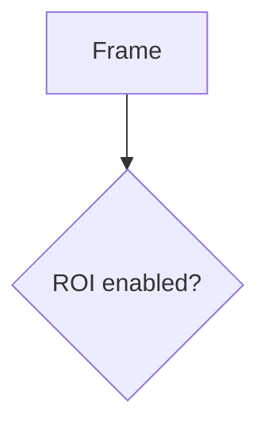
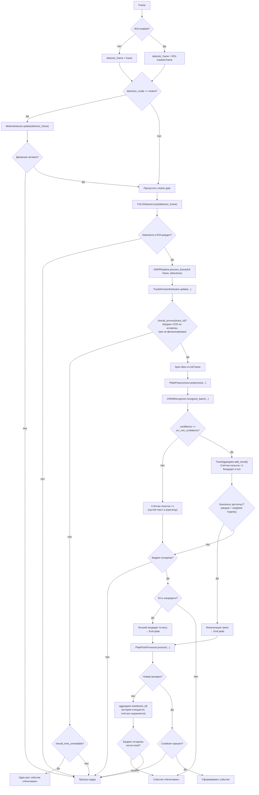

# Handoff: UI + README Changes for Track-Level OCR

## Status: IN PROGRESS

---

## 1. What Is Already Completed

### A. Backend (fully done — previous session)
All backend changes for `max_ocr_attempts` are complete and tested:

- **`anpr/pipeline/anpr_pipeline.py`** — `_TrackOCRState` dataclass, `TrackAggregator` extended with OCR budget/finalization (`should_process`, `should_emit_unreadable`, `_best_candidate`, budget-aware `add_result`, budget-preserving `reset`). `ANPRPipeline.process_frame` skips OCR for finalized tracks, routes low-confidence through aggregator, emits one unreadable per track.
- **`anpr/pipeline/factory.py`** — accepts and passes `max_ocr_attempts` to `ANPRPipeline`.
- **`runtime/channel_runtime.py`** — reads `max_ocr_attempts` from channel config dict, passes to `build_components`.
- **`config/settings_schema.py`** — `max_ocr_attempts: 15` in `channel_defaults()` and `build_default_settings()` tracking section.
- **`config/settings.yaml`** — `max_ocr_attempts: 15` added to both channels and tracking section.
- **`app/api/schemas.py`** — `max_ocr_attempts` field added to both `ChannelConfigPayload` (Field default=15, ge=1, le=200) and `ChannelOCRPayload`.
- **`tests/test_track_aggregator.py`** — 14 new tests (22 total), all passing.

### B. CSS (done this session)
- **`app/web/styles.css`** — Added at line ~1023 (after `.s-row-desc`):
  - `.s-row-label` updated to `display: flex; align-items: center; gap: 4px;`
  - `.param-help-btn` — 14px round button, `?` icon, hover accent color
  - `.param-help-popover` — fixed-position popup, dark theme, shadow, animation
  - `@keyframes helpPopIn` — fade+slide entry animation
  - `.param-help-popover-title` — accent-colored mono title

---

## 2. Exact Files Changed So Far

| File | Status |
|---|---|
| `anpr/pipeline/anpr_pipeline.py` | Done |
| `anpr/pipeline/factory.py` | Done |
| `runtime/channel_runtime.py` | Done |
| `config/settings_schema.py` | Done |
| `config/settings.yaml` | Done |
| `app/api/schemas.py` | Done |
| `tests/test_track_aggregator.py` | Done |
| `app/web/styles.css` | Done (help popover CSS added) |
| `app/web/index.html` | **TODO** |
| `app/web/app.js` | **TODO** |
| `README.md` | **TODO** |

---

## 3. Remaining Edits

### 3A. `app/web/index.html` — Two changes

#### Change 1: Add `max_ocr_attempts` input field

**Location**: Inside `<div id="ch-group-ocr">`, after the `Мин. уверенность OCR` row (after line 544).

**Find this exact string** (the closing of the ocr_conf row + the closing of the card body):
```html
                      />
                    </div>
                  </div>
                </div>
                <div
                  class="s-card ch-group"
                  id="ch-group-roi"
```

**Insert BEFORE the `</div></div>` that closes `ch-group-ocr`** (i.e., between the last `</div>` of the ocr_conf s-row and the `</div>` of s-card-body):

```html
                    <div class="s-row">
                      <div class="s-row-label">
                        <div class="s-row-name">Макс. OCR попыток на трек</div>
                      </div>
                      <input
                        class="s-input sm"
                        id="c_max_ocr_attempts"
                        type="number"
                        min="1"
                        max="200"
                      />
                    </div>
```

**Precise insertion point**: After line 543 (`step="0.01"`) and the closing `/>` and `</div>` of that row. The exact old_string for Edit tool:

```
                      />
                    </div>
                  </div>
                </div>
                <div
                  class="s-card ch-group"
                  id="ch-group-roi"
```

Replace with:
```
                      />
                    </div>
                    <div class="s-row">
                      <div class="s-row-label">
                        <div class="s-row-name">Макс. OCR попыток на трек</div>
                      </div>
                      <input
                        class="s-input sm"
                        id="c_max_ocr_attempts"
                        type="number"
                        min="1"
                        max="200"
                      />
                    </div>
                  </div>
                </div>
                <div
                  class="s-card ch-group"
                  id="ch-group-roi"
```

#### Change 2: Add help buttons to ALL parameter rows

Every `<div class="s-row-label">` that contains a `<div class="s-row-name">` needs a help button added. The button is a `<button class="param-help-btn" data-help="PARAM_KEY">?</button>` placed BEFORE the `<div class="s-row-name">`.

**Pattern** — transform every occurrence of:
```html
<div class="s-row-label">
  <div class="s-row-name">LABEL TEXT</div>
</div>
```
Into:
```html
<div class="s-row-label">
  <button class="param-help-btn" data-help="PARAM_KEY">?</button>
  <div class="s-row-name">LABEL TEXT</div>
</div>
```

**Complete mapping of PARAM_KEY to label text** (use these exact `data-help` values — they must match the JS dictionary keys):

| `data-help` key | Label text in HTML | Section |
|---|---|---|
| `name` | Название | Channel |
| `source` | Источник / RTSP | Channel |
| `list_filter_mode` | Режим фильтра списков | Channel |
| `list_filter_list_ids` | Выбрать списки | Channel |
| `detection_mode` | Режим обнаружения ТС | Motion |
| `motion_threshold` | Порог движения | Motion |
| `motion_frame_stride` | Частота анализа (кадр) | Motion |
| `motion_activation_frames` | Мин. кадров с движением | Motion |
| `motion_release_frames` | Мин. кадров без движения | Motion |
| `detector_frame_stride` | Шаг инференса (кадр) | Detector |
| `size_filter_enabled` | Фильтрация размеров | Detector |
| `min_plate_size` | Мин. размер рамки (ш,в) | Detector |
| `max_plate_size` | Макс. размер рамки (ш,в) | Detector |
| `best_shots` | Бестшоты на трек | OCR |
| `cooldown_seconds` | Пауза повтора (сек) | OCR |
| `ocr_min_confidence` | Мин. уверенность OCR | OCR |
| `max_ocr_attempts` | Макс. OCR попыток на трек | OCR |
| `roi_enabled` | Использование ROI | ROI |
| `roi_points` | Точки ROI (JSON) | ROI |
| `controller_id` | Контроллер | Controller |
| `controller_relay` | Реле | Controller |

**Important**: The s-row-label for "Выбрать списки" is inside `id="c_custom_lists_block"` which is conditionally shown. The help button still works because it's inside the label div. The empty s-row-label at `c_custom_lists_hint` (line 402) should NOT get a help button (it has no s-row-name).

---

### 3B. `app/web/app.js` — Three changes

#### Change 1: Wire `max_ocr_attempts` into load

**Find** (around line 1641):
```js
  setVal("c_ocr_conf", c.ocr_min_confidence ?? 0.6);
```

**Replace with**:
```js
  setVal("c_ocr_conf", c.ocr_min_confidence ?? 0.6);
  setVal("c_max_ocr_attempts", c.max_ocr_attempts ?? 15);
```

#### Change 2: Wire `max_ocr_attempts` into save payload

**Find** (around line 1695):
```js
    ocr_min_confidence: Number(val("c_ocr_conf")),
```

**Replace with**:
```js
    ocr_min_confidence: Number(val("c_ocr_conf")),
    max_ocr_attempts: Number(val("c_max_ocr_attempts")),
```

#### Change 3: Add help text dictionary + popover logic

**Insert at the END of app.js** (after the last line of the file). This is a self-contained block:

```js
/* ─── Parameter help popover system ─────────────────── */
const PARAM_HELP = {
  name: "Отображаемое имя канала. Используется в журнале событий, заголовках превью и при сохранении медиафайлов.",
  source: "Адрес видеопотока. Поддерживаются RTSP, HTTP, локальные файлы и индексы камер (0, 1, …). Канал открывает этот источник через OpenCV VideoCapture.",
  list_filter_mode: "Определяет, при каких номерах срабатывает реле контроллера.\n• «Все» — реле для любого номера (кроме чёрного списка).\n• «Белые списки» — только номера из списков типа white.\n• «Свои списки» — только номера из выбранных ниже списков.\nЧёрный список блокирует срабатывание всегда.",
  list_filter_list_ids: "Выбор конкретных списков номеров, которые разрешают срабатывание реле в режиме «Свои списки». Чёрный список применяется автоматически в любом режиме.",
  detection_mode: "Режим запуска детектора YOLO.\n• «always» — детектор работает на каждом кадре (с учётом шага инференса).\n• «motion» — детектор запускается только при обнаружении движения в кадре. Экономит CPU при пустых сценах.",
  motion_threshold: "Доля пикселей, изменившихся между кадрами, при которой считается, что в кадре есть движение. Значение 0.01 = 1% пикселей. Меньше — выше чувствительность, больше ложных срабатываний.",
  motion_frame_stride: "Через сколько кадров проводить анализ движения. При stride=2 движение проверяется на каждом 2-м кадре. Промежуточные кадры пропускаются, но состояние motion сохраняется.",
  motion_activation_frames: "Сколько подряд проанализированных кадров с движением нужно, чтобы активировать состояние motion и начать запуск детектора YOLO. Защита от разовых шумов.",
  motion_release_frames: "Сколько подряд проанализированных кадров без движения нужно, чтобы деактивировать состояние motion и прекратить запуск детектора. Защита от преждевременной остановки при кратковременной паузе.",
  detector_frame_stride: "Через сколько кадров (прошедших motion gate) запускать YOLO-детекцию и трекинг. При stride=2 — каждый второй кадр. Снижает нагрузку CPU/GPU за счёт частоты обнаружения.",
  size_filter_enabled: "Включить фильтрацию найденных номерных рамок по размеру (ширина и высота в пикселях). Отсекает слишком маленькие и слишком большие обнаружения.",
  min_plate_size: "Минимальная ширина и высота обнаруженной номерной рамки в пикселях. Рамки меньше этого размера отбрасываются до OCR. Помогает отфильтровать далёкие или нерелевантные объекты.",
  max_plate_size: "Максимальная ширина и высота обнаруженной номерной рамки в пикселях. Рамки больше этого размера отбрасываются. Помогает отфильтровать ложные детекции на крупных объектах.",
  best_shots: "Сколько лучших OCR-наблюдений накапливается на один трек для голосования. Из них выбирается консенсус — номер, набравший кворум (≥ половины) и наибольший суммарный вес уверенности. По умолчанию 3.",
  cooldown_seconds: "Пауза (в секундах) между повторными событиями для одного и того же номера. Если номер уже был распознан менее N секунд назад — повторное событие не создаётся. Предотвращает дублирование при медленном проезде.",
  ocr_min_confidence: "Минимальный порог уверенности OCR (0.0–1.0). Результаты ниже порога не попадают в пул кандидатов трека и считаются нечитаемыми. По умолчанию 0.6.",
  max_ocr_attempts: "Максимальное число OCR-попыток для одного трека. После исчерпания бюджета OCR для этого трека прекращается — кроп, предобработка и CRNN-инференс больше не выполняются.\n\nЕсли консенсус был достигнут раньше — трек финализируется досрочно.\nЕсли бюджет исчерпан без консенсуса — выбирается лучший кандидат по весу.\nЕсли кандидатов нет — генерируется одно событие «Нечитаемо».\n\nПо умолчанию 15.",
  roi_enabled: "Включить зону интереса (Region of Interest). Когда включено, только обнаружения с центром bbox внутри ROI-полигона обрабатываются. Детекция YOLO по-прежнему работает по всему кадру, но результаты за пределами ROI отбрасываются.",
  roi_points: "JSON-представление точек ROI-полигона. Координаты в пикселях канваса. Минимум 3 точки для замкнутой области. Редактируйте визуально на канвасе выше или вручную.",
  controller_id: "Привязка аппаратного контроллера к этому каналу. При распознавании номера, прошедшего фильтр списков, на контроллер отправляется HTTP-команда для срабатывания выбранного реле.",
  controller_relay: "Какое из двух реле контроллера использовать для этого канала (Реле 1 или Реле 2). Режим работы реле (pulse / pulse_timer) настраивается в параметрах контроллера."
};

let _activeHelpPopover = null;

function _closeHelpPopover() {
  if (_activeHelpPopover) {
    _activeHelpPopover.remove();
    _activeHelpPopover = null;
  }
}

function _showHelpPopover(btn) {
  _closeHelpPopover();
  const key = btn.getAttribute("data-help");
  const text = PARAM_HELP[key];
  if (!text) return;

  const pop = document.createElement("div");
  pop.className = "param-help-popover";
  pop.innerHTML =
    '<div class="param-help-popover-title">' +
    btn.closest(".s-row-label").querySelector(".s-row-name").textContent +
    "</div>" +
    text.replace(/\n/g, "<br>");
  document.body.appendChild(pop);

  const r = btn.getBoundingClientRect();
  let top = r.bottom + 6;
  let left = r.left;
  // Ensure it fits on screen
  pop.style.left = left + "px";
  pop.style.top = top + "px";
  requestAnimationFrame(() => {
    const pr = pop.getBoundingClientRect();
    if (pr.right > window.innerWidth - 8) pop.style.left = Math.max(8, window.innerWidth - pr.width - 8) + "px";
    if (pr.bottom > window.innerHeight - 8) pop.style.top = Math.max(8, r.top - pr.height - 6) + "px";
  });

  _activeHelpPopover = pop;
}

document.addEventListener("click", (e) => {
  const btn = e.target.closest(".param-help-btn");
  if (btn) {
    e.preventDefault();
    e.stopPropagation();
    if (_activeHelpPopover && _activeHelpPopover._helpBtn === btn) {
      _closeHelpPopover();
    } else {
      _showHelpPopover(btn);
      if (_activeHelpPopover) _activeHelpPopover._helpBtn = btn;
    }
    return;
  }
  if (_activeHelpPopover && !e.target.closest(".param-help-popover")) {
    _closeHelpPopover();
  }
});

document.addEventListener("keydown", (e) => {
  if (e.key === "Escape") _closeHelpPopover();
});
```

---

### 3C. `README.md` — Update for new algorithm

**Replace the entire "Диаграмма 3. Внутренний ANPR pipeline" section** (lines 216–259) with the updated diagram that includes the track-level OCR budget logic.

**Find** (exact):
```
### Диаграмма 3. Внутренний ANPR pipeline



...everything through...

```
    X -->|Да| Y["Сформировать событие"]
```​
```

**Replace with**:
````markdown
### Диаграмма 3. Внутренний ANPR pipeline


````

**Then, after the "Алгоритмы ядра" table (after line ~272), insert a new section**.

**Find**:
```
| **PlatePostProcessor** | Нормализация (uppercase, Ё→Е, strip) → коррекции по стране → валидация против regex-форматов YAML-конфигов |

---

## Поток данных
```

**Replace with** (add new section between the table and "Поток данных"):
````markdown
| **PlatePostProcessor** | Нормализация (uppercase, Ё→Е, strip) → коррекции по стране → валидация против regex-форматов YAML-конфигов |

### Трек-уровневый алгоритм OCR

Начиная с v0.8, каждый трек имеет **ограниченный бюджет OCR-попыток** (`max_ocr_attempts`, по умолчанию 15). Это радикально снижает нагрузку CPU для долгоживущих треков и предотвращает спам событий.

#### Состояние трека (`_TrackOCRState`)

| Поле | Описание |
|---|---|
| `ocr_attempts` | Число выполненных OCR-попыток (включая low-confidence) |
| `finalized` | Трек финализирован — дальнейший OCR запрещён |
| `result_emitted` | Был ли эмитирован валидный результат |
| `unreadable_emitted` | Было ли эмитировано событие «Нечитаемо» |

#### Когда OCR продолжается

`should_process(track_id)` возвращает `True`, пока:
- трек не финализирован (`finalized == False`);
- число попыток < `max_ocr_attempts`.

Если `should_process` возвращает `False`, для этого трека **полностью пропускаются**: кроп ROI, предобработка, CRNN-инференс. Это основной путь экономии CPU.

#### Когда трек финализируется

1. **Ранний консенсус** — кворум (≥ `(best_shots + 1) // 2` одинаковых текстов) + weighted majority (≥ 50% суммарного веса). Трек финализируется немедленно.
2. **Исчерпание бюджета** — `ocr_attempts >= max_ocr_attempts`. Если есть кандидаты — выбирается лучший по весу. Если кандидатов нет — трек помечается как unreadable.
3. **Постпроцессор отклонил номер** — `reset()` очищает кандидатов, но **сохраняет счётчик попыток**. Если бюджет ещё не исчерпан — трек продолжает обработку. Если исчерпан — финализация.

#### Как выбирается финальный номер

- **При консенсусе**: номер с наибольшим `(суммарный_вес, количество)` среди кандидатов в скользящем буфере.
- **При исчерпании бюджета**: `_best_candidate()` — тот же алгоритм, но без требования кворума.
- **Если кандидатов нет**: `should_emit_unreadable()` возвращает `True` ровно один раз → pipeline генерирует одно событие «Нечитаемо».

#### Предотвращение дублирования

- `last_emitted[track_id]` хранит последний эмитированный текст — повторная эмиссия того же номера невозможна.
- `result_emitted` — флаг, что валидный результат уже был.
- `unreadable_emitted` — флаг, что событие «Нечитаемо» уже было. `should_emit_unreadable` возвращает `True` только один раз.
- После финализации `should_process` возвращает `False` — никакой дальнейшей обработки.

#### Три практических сценария

**1. Стабильный распознанный трек**

Номер `А123ВС77` хорошо виден, OCR уверенно распознаёт его.

| Попытка | OCR текст | Confidence | Действие |
|---|---|---|---|
| 1 | А123ВС77 | 0.92 | Кандидат добавлен, кворум не достигнут |
| 2 | А123ВС77 | 0.89 | Кандидат добавлен, кворум не достигнут |
| 3 | А123ВС77 | 0.91 | **Консенсус**: кворум 3/3, majority 100% → emit `А123ВС77`, финализация |
| 4+ | — | — | `should_process → False`, OCR не запускается |

**Результат**: 1 событие с номером. CPU-работа прекращается после 3 попыток.

**2. Шумный / конфликтный трек**

Номер частично закрыт, OCR выдаёт разные варианты.

| Попытка | OCR текст | Confidence | Действие |
|---|---|---|---|
| 1 | А123ВС77 | 0.82 | Кандидат добавлен |
| 2 | А1Z3ВС77 | 0.65 | Кандидат добавлен |
| 3 | А123ВС77 | 0.78 | Кворум для А123ВС77: 2/3, но majority проверяется... |
| … | (разные) | | Консенсус не достигается |
| 15 | — | 0.45 | **Бюджет исчерпан**. `_best_candidate` → `А123ВС77` (наибольший суммарный вес) → emit, финализация |

**Результат**: 1 событие с лучшим кандидатом. 15 OCR-попыток, далее CPU не тратится.

**3. Полностью нечитаемый трек**

Номер слишком далеко или засвечен, OCR confidence всегда ниже порога.

| Попытка | OCR текст | Confidence | Действие |
|---|---|---|---|
| 1 | (мусор) | 0.35 | Ниже `ocr_min_confidence` → пустой текст, счётчик +1 |
| 2 | (мусор) | 0.28 | Счётчик +1 |
| … | | | |
| 15 | (мусор) | 0.31 | **Бюджет исчерпан**, кандидатов нет → финализация |
| 16+ | — | — | `should_process → False`, `should_emit_unreadable → True` (один раз) → emit «Нечитаемо» |

**Результат**: 1 событие «Нечитаемо». Без бюджета эта же ситуация генерировала бы событие на каждом кадре.

### Конфигурация `max_ocr_attempts`

| Параметр | Тип | По умолчанию | Диапазон | Расположение |
|---|---|---|---|---|
| `max_ocr_attempts` | int | 15 | 1–200 | `config/settings.yaml` → `tracking.max_ocr_attempts` и в каждом канале |

**Взаимодействие с другими параметрами:**

- **`best_shots`** (по умолчанию 3): определяет размер скользящего буфера и кворум. Если `max_ocr_attempts < best_shots`, консенсус невозможен — используется fallback на лучшего кандидата.
- **`ocr_min_confidence`** (по умолчанию 0.6): результаты ниже порога не попадают в пул кандидатов, но **расходуют бюджет**.
- **`cooldown_seconds`** (по умолчанию 5): работает после финализации — если тот же номер уже был недавно, событие подавляется.
- **`detector_frame_stride`**: определяет, как часто вообще запускается детекция. `max_ocr_attempts` считает только кадры, на которых OCR действительно выполнялся.

---

## Поток данных
````

**Also update the "Алгоритмы ядра" table row for TrackAggregator** (around line 269).

**Find**:
```
| **TrackAggregator** | Скользящий буфер (text, confidence) на трек; взвешенное голосование с порогом quorum; TTL-вытеснение |
```

**Replace with**:
```
| **TrackAggregator** | Скользящий буфер (text, confidence) на трек; взвешенное голосование с порогом quorum; TTL-вытеснение; **бюджет OCR-попыток** (`max_ocr_attempts`); финализация трека при консенсусе или исчерпании бюджета; fallback на лучшего кандидата; одноразовое событие «Нечитаемо» |
```

**Also update the OCR API endpoint description** (around line 408).

**Find**:
```
| `PUT` | `/api/channels/{channel_id}/ocr` | Обновить OCR-параметры (best_shots, cooldown, confidence) |
```

**Replace with**:
```
| `PUT` | `/api/channels/{channel_id}/ocr` | Обновить OCR-параметры (best_shots, cooldown, confidence, max_ocr_attempts) |
```

---

## 4. Selectors, Function Names, and Insertion Points

### HTML IDs
- New input: `id="c_max_ocr_attempts"` (in `ch-group-ocr` card)
- Help buttons: `class="param-help-btn"` with `data-help="KEY"` attribute
- No new modals needed — help uses dynamically created `div.param-help-popover`

### JS Functions
- `_showHelpPopover(btn)` — creates and positions popover
- `_closeHelpPopover()` — removes active popover
- `PARAM_HELP` object — dictionary of all help texts keyed by parameter name
- Load: `setVal("c_max_ocr_attempts", c.max_ocr_attempts ?? 15)` after line ~1641
- Save: `max_ocr_attempts: Number(val("c_max_ocr_attempts"))` after line ~1695

### CSS Classes (already added)
- `.param-help-btn` — the `?` button
- `.param-help-popover` — the popup container
- `.param-help-popover-title` — title line in popup

---

## 5. Pitfalls and Dependencies

1. **s-row-label flex override**: The CSS already added `display: flex; align-items: center; gap: 4px;` to `.s-row-label`. This might conflict with the existing flex rule at line 598 (`.s-row-label { flex: 0 1 180px; min-width: 0; }`). The existing rule sets flex shorthand for the PARENT's flex context (how s-row-label behaves inside s-row). The new rule sets the INTERNAL layout. These are compatible — `flex: 0 1 180px` is the flex item sizing, and `display: flex` is the internal layout model. **No conflict.**

2. **Help button click vs. input focus**: The `.param-help-btn` uses `e.preventDefault(); e.stopPropagation()` so clicking it won't accidentally affect adjacent inputs or checkboxes.

3. **Popover positioning**: The popover is positioned with `position: fixed` relative to the viewport. It uses `requestAnimationFrame` to reposition if it overflows right or bottom edges. Scroll inside the settings panel won't break positioning because it's fixed to viewport.

4. **Escape key**: The `keydown` listener for Escape closes the popover. This won't conflict with modal close handlers because those check for specific modal IDs.

5. **Empty s-row-label**: Line 402 has an empty `<div class="s-row-label"></div>` for the custom lists hint row. Do NOT add a help button there — it has no `s-row-name` child.

6. **ROI canvas area**: The ROI section has a `<canvas>` and action buttons outside of s-row. These don't need help buttons — only the labeled parameter rows do.

7. **Backwards compatibility**: Existing configs without `max_ocr_attempts` work because:
   - `ChannelConfigPayload` has `default=15`
   - `settings_schema.py` `channel_defaults()` provides fallback
   - JS uses `c.max_ocr_attempts ?? 15`
   - `runtime/channel_runtime.py` uses `channel.get("max_ocr_attempts", 15)`

8. **README diagram rendering**: The mermaid diagram uses `\n` inside node labels for line breaks. GitHub renders these correctly. The `BUDGET`, `EXHAUST`, `UNREAD` node IDs don't conflict with existing IDs in other diagrams (each is inside its own ```mermaid block).

9. **settings_normalizer.py**: Inspect whether this file applies defaults to channels on load. If it does NOT add `max_ocr_attempts`, existing saved channels will load without it — but the `?? 15` fallback in JS and `.get("max_ocr_attempts", 15)` in runtime handle this. For robustness, consider adding it to the normalizer if one exists, but this is not blocking.
