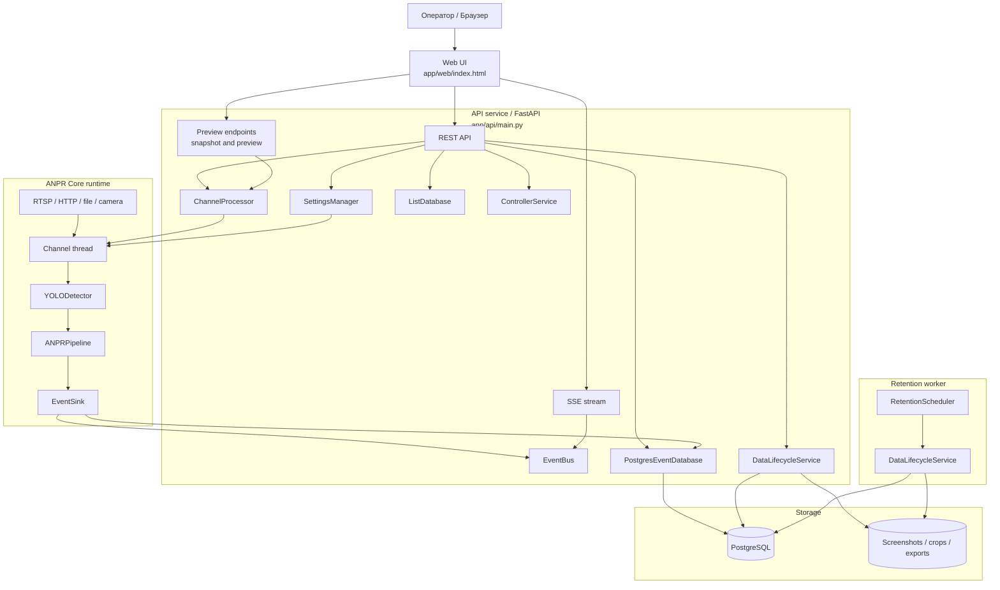
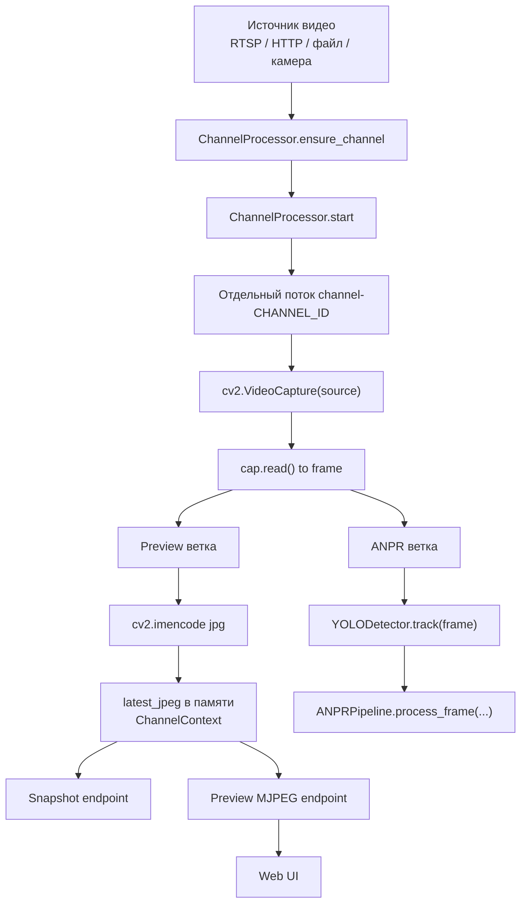
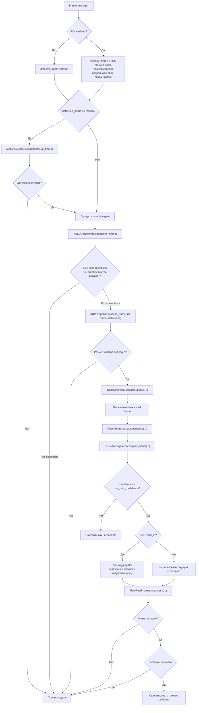
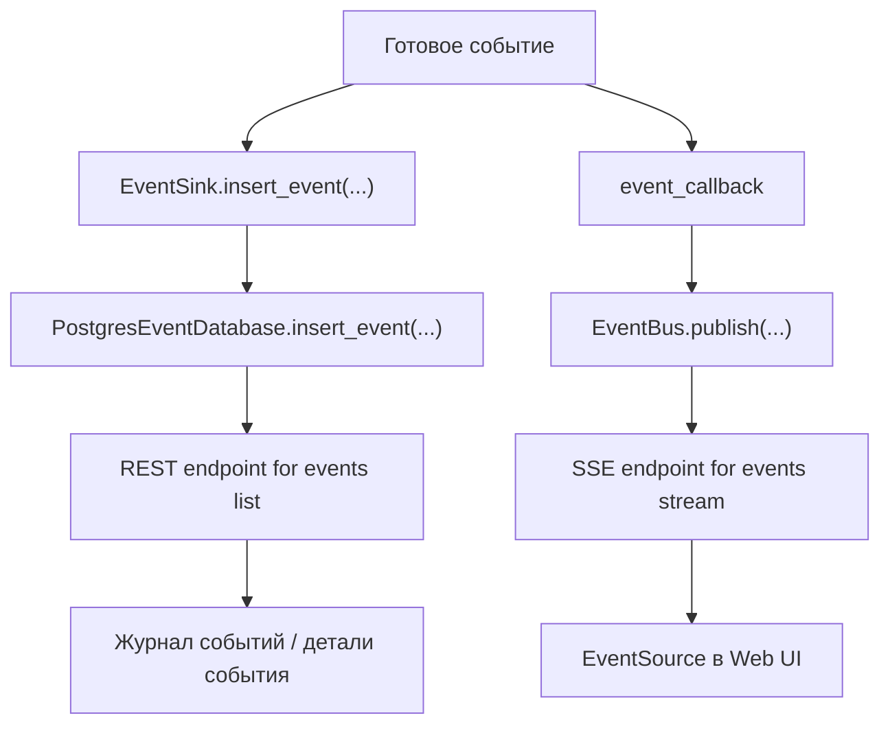
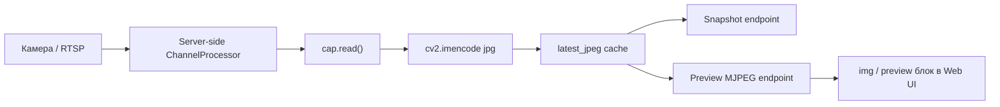
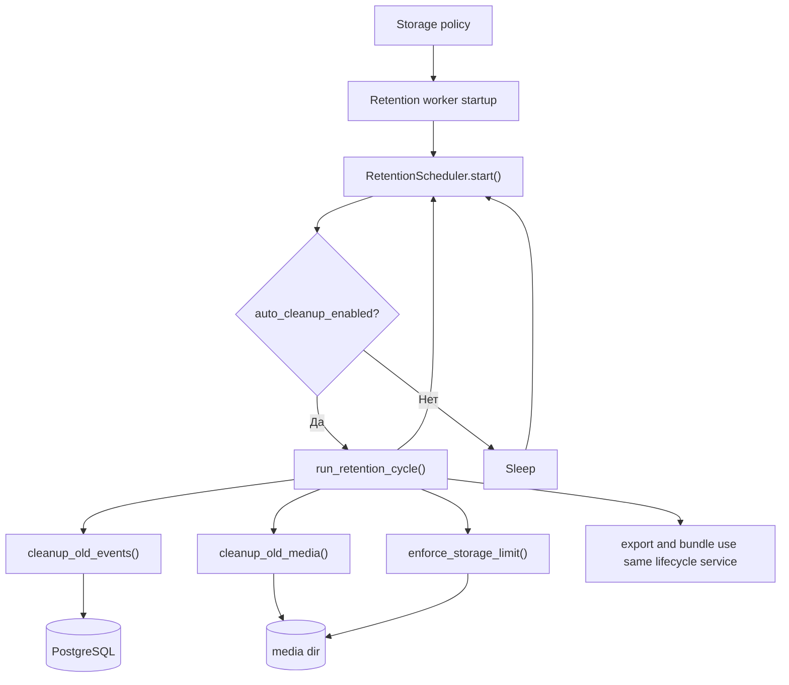

# ANPR System v0.8 Web


Система автоматического распознавания автомобильных номеров.

Проект выполняет server-side обработку видеопотоков, распознаёт номера, сохраняет события, публикует live-обновления в браузер и отдаёт live preview без отдельного медиасервера.

---

## Что умеет система

- многоканальная обработка видео: отдельный runtime на каждый канал;
- server-side ANPR pipeline: детекция, OCR, агрегация по треку, постобработка, cooldown;
- web UI оператора: наблюдение, журнал, списки, настройки;
- live preview по MJPEG из того же channel runtime;
- live-события через SSE;
- управление каналами через API: создать, изменить, запустить, остановить, перезапустить;
- настройка ROI, размера номера, OCR порогов, cooldown и direction heuristics;
- white/black/custom plate lists;
- управление контроллерами через API;
- retention / cleanup / CSV / ZIP export;
- PostgreSQL как единственный supported storage backend.

---

## Как устроен проект

Система разделена на три основных контура:

1. **API service**  
   FastAPI приложение, которое:
   - обслуживает web UI;
   - хранит и отдаёт настройки;
   - управляет каналами;
   - публикует live events;
   - отдаёт snapshot и MJPEG preview.

2. **Channel runtime / ANPR Core**  
   Для каждого канала создаётся отдельный поток обработки, который:
   - открывает источник видео;
   - читает кадры;
   - формирует preview JPEG в памяти;
   - прогоняет кадры через YOLO + OCR pipeline;
   - сохраняет события в storage;
   - отправляет события в EventBus.

3. **Retention worker**  
   Отдельный сервис для:
   - очистки старых событий;
   - удаления старых медиа;
   - контроля размера media storage;
   - экспорта CSV / ZIP.

---

## Быстрый старт

Поддерживаемая модель runtime: Docker Compose.

### Предварительные требования

- Docker Engine 24+
- Docker Compose v2+
- Файлы моделей в `anpr/models/`

### Подготовка конфигурации

```bash
cp .env.example .env
```

### Рекомендуемый запуск

```bash
docker compose up -d --build
```

### Что поднимается

- `nginx` — единственная опубликованная точка входа с хоста;
- `api` — FastAPI + Web UI + channel runtime orchestration;
- `retention_worker` — фоновый retention/cleanup;
- `postgres` — PostgreSQL c инициализацией схемы.

### Порты и доступ

- `HTTP_PORT` (по умолчанию `8080`) публикуется наружу сервисом `nginx`.
- `postgres` наружу не публикуется и доступен только внутри docker-сети.
- `api` и `retention_worker` доступны по внутренним DNS-именам контейнерной сети (`api:8080`, `retention_worker:8092`).

Точки доступа:
- Web UI: `http://localhost:${HTTP_PORT}`
- API health: `http://localhost:${HTTP_PORT}/api/health`
- Worker health: `http://localhost:${HTTP_PORT}/worker/health`

### Volumes

- `pgdata` — данные PostgreSQL;
- `media_data` — `data/screenshots` и `data/exports` для API/worker;
- `logs_data` — `logs` для API/worker.

### Логи и диагностика

```bash
docker compose logs -f nginx api retention_worker postgres
```

Централизованное логирование настроено через единый слой `common/logging.py` для API, worker и runtime-компонентов.

- директория логов берётся из `storage.logs_dir` (по умолчанию `logs`);
- файлы разделены по сервисам и часу: `api_YYYY-MM-DD_HH-00.log`, `worker_YYYY-MM-DD_HH-00.log`;
- поддерживаемые уровни: `ALL`, `DEBUG`, `INFO`, `WARNING`, `ERROR`, `CRITICAL`;
- `ALL` отключает фильтрацию по уровню (в Python logging соответствует `NOTSET`).

Проверки:

```bash
curl http://localhost:${HTTP_PORT}/api/health
curl http://localhost:${HTTP_PORT}/worker/health
curl http://localhost:${HTTP_PORT}/api/channels
curl -o snapshot.jpg http://localhost:${HTTP_PORT}/api/channels/1/snapshot.jpg
```

### Обновление / пересборка

```bash
docker compose pull
docker compose build --no-cache
docker compose up -d
```

### Остановка

```bash
docker compose down
```

### Полный сброс данных (осторожно)

```bash
docker compose down -v
```

---

## Схема конфигурации

- `.env` — единственный слой переменных окружения для контейнеров (`POSTGRES_*`, `POSTGRES_DSN`, `HTTP_PORT`, `LOG_LEVEL`, `SETTINGS_PATH`) и лежит в корне проекта.
- `.env.example` — шаблон для Docker Compose, лежит в корне проекта и не используется как runtime-файл.
- `config/settings.yaml` — единственный рабочий settings-файл ANPR runtime (каналы, ROI, OCR/детекция, retention, контроллеры).
- `settings.example.yaml` и root `settings.yaml` не используются.
- `api` и `retention_worker` используют один и тот же путь `SETTINGS_PATH=/app/config/settings.yaml`.
- PostgreSQL — единственный backend runtime-данных (события, списки, записи).

Перед запуском нужно подготовить:
- `.env` (из `.env.example`);
- `config/settings.yaml` (рабочий конфиг приложения).

Бэкап/перенос конфигурации выполняется копированием `config/settings.yaml` и `.env`.

Важно: значения по умолчанию в конфигурации ориентированы на docker-сеть (`postgres` как hostname БД).

### Версионирование и совместимость `settings.yaml`

В проекте действует единый механизм upgrade/compatibility для системных настроек:

- Каноническая линия схемы: `settings_lineage: mainline`.
- Текущая версия схемы для этой линии: `settings_version: 1`.
- При загрузке настроек система всегда приводит supported legacy-конфиги к текущему каноническому формату и, если были изменения, сохраняет результат обратно в `config/settings.yaml`.

Как это работает:

1. Если в файле **нет** `settings_lineage`, конфиг трактуется как legacy-формат и проходит compatibility-upgrade (включая нормализацию ROI/direction).
2. Если `settings_lineage == mainline`, применяется проверка версии для текущей линии:
   - поддерживаемые версии подтягиваются до актуальной схемы;
   - future-версия (`settings_version` выше поддерживаемой) считается несовместимой и вызывает явную ошибку (без silent downgrade файла).
3. Если `settings_lineage` присутствует, но отличается от `mainline`, конфиг считается неподдерживаемой линией схемы и загрузка завершается явной ошибкой (без принудительной перезаписи в `mainline`).

Правило развития схемы:

- любое изменение структуры/формата полей `config/settings.yaml` требует повышения версии схемы и обновления compatibility-path до новой версии.

---

## Диаграмма 1. Общая схема взаимодействия сервисов



---

## Диаграмма 2. Что происходит после подключения видеопотока

Эта схема отвечает на вопрос: как канал получает видео, где рождается preview и куда уходит кадр на распознавание.



---

## Диаграмма 3. Внутренний ANPR pipeline

Это основная процессная диаграмма распознавания номера в текущем проекте.



---

## Диаграмма 4. Как событие сохраняется и попадает в UI



---

## Диаграмма 5. Как работает video preview для UI

Здесь важно, что браузер получает не прямой RTSP, а уже подготовленный сервером MJPEG поток.



---

## Диаграмма 6. Retention и обслуживание хранения



---

## Поток данных по шагам

### 1. Подключение канала

При старте API читает список каналов из `config/settings.yaml`.  
Для каждого канала `ChannelProcessor` создаёт `ChannelContext`.  
Если канал `enabled=true`, для него сразу запускается отдельный thread.

### 2. Получение кадров

Поток канала открывает источник через `cv2.VideoCapture(source)` и в цикле вызывает `cap.read()`.

Переподключение управляется глобальным блоком `reconnect` из настроек:
- `reconnect.signal_loss.enabled` включает/отключает контроль таймаута чтения кадра и времени с последнего валидного кадра (при `false` timeout-watchdog не применяется);
- при таймауте `reconnect.signal_loss.frame_timeout_seconds` увеличивается `timeout_count` и выполняется controlled reconnect;
- пауза между попытками при потере сигнала/ошибке чтения берётся из `reconnect.signal_loss.retry_interval_seconds`;
- `reconnect.periodic.enabled` включает принудительный reconnect каждые `reconnect.periodic.interval_minutes` независимо от signal-loss сценария; при неудачном periodic reopen повтор выполняется с паузой `reconnect.signal_loss.retry_interval_seconds`.

При любой реальной попытке reconnect увеличивается `reconnect_count`, предыдущий `VideoCapture` освобождается, а после восстановления поток снова отдаёт preview без ручного обновления страницы.

### 3. Формирование preview

Примерно раз в `0.2` секунды текущий кадр кодируется в JPEG и сохраняется в память:
- `latest_jpeg`
- `latest_frame_ts`
- `preview_ready`
- `preview_last_frame_at`

Дальше API отдаёт этот же буфер:
- как единичный снимок через `/api/channels/{id}/snapshot.jpg`;
- как multipart MJPEG поток через `/api/channels/{id}/preview.mjpg`.

### 4. Детекция и распознавание

Тот же кадр идёт в:
- `YOLODetector.track(frame)`;
- затем в `ANPRPipeline.process_frame(frame, detections)`.

Внутри pipeline выполняются:
- обновление направления движения по треку;
- кроп bbox номера;
- preprocessing;
- batch OCR;
- агрегация результата по треку;
- постобработка и валидация;
- cooldown-фильтр.

### 5. Сохранение события

Если номер валиден и cooldown прошёл, формируется событие с полями:
- `timestamp`
- `channel`
- `channel_id`
- `plate`
- `country`
- `confidence`
- `source`
- `direction`

Событие записывается в storage через `EventSink`.

### 6. Публикация события в UI

После записи событие публикуется в `EventBus`, а затем попадает в браузер через `/api/events/stream`.

UI параллельно:
- держит live stream для новых событий (отдельное состояние live feed);
- подгружает историю журнала страницами через `/api/events` (cursor-based, без `OFFSET`);
- открывает детали события и связанные изображения через `/api/events/item/{id}` и `/api/events/item/{id}/media/{kind}`.

---

## Основные компоненты

### Backend / API

- `app/api/main.py` — главный FastAPI backend;
- `app/shared/data_lifecycle.py` — общая retention/cleanup/export логика для API и worker;
- `packages/anpr_core/channel_runtime.py` — runtime каналов;
- `packages/anpr_core/event_bus.py` — in-memory pub/sub для live событий;
- `packages/anpr_core/event_sink.py` — запись событий в PostgreSQL.

### ANPR

- `anpr/detection/yolo_detector.py` — детектор номерных рамок и tracking fallback logic;
- `anpr/pipeline/anpr_pipeline.py` — OCR pipeline, aggregator, direction estimator, cooldown;
- `anpr/preprocessing/plate_preprocessor.py` — коррекция перспективы / наклона;
- `anpr/recognition/crnn_recognizer.py` — OCR CRNN;
- `anpr/postprocessing/validator.py` — валидация по конфигам стран;
- `anpr/detection/motion_detector.py` — модуль motion detection; используется в runtime при `detection_mode=motion`.

### Controllers (интеграция с оборудованием)

- `controllers/service.py` — отправка команд контроллерам и автоматическая реакция на готовые ANPR-события;
- `controllers/registry.py` — реестр поддерживаемых адаптеров;
- `controllers/base.py` — базовый контракт адаптера;
- `controllers/adapters/dtwonder2ch.py` — адаптер типа **DTWONDER2CH**.

Слой `controllers` не входит в ANPR core: runtime каналов формирует событие распознавания, а контроллерный слой отдельно принимает это событие и решает, отправлять ли команду на реле.

### Web UI

`app/web/index.html` — операторская панель с вкладками:
- Наблюдение;
- Журнал;
- Списки;
- Настройки.

Отображение направления движения в UI использует подписи **«Приближение»** и **«Отдаление»**.
Эти значения показываются в журнале и в блоке последних событий.

### Worker

`app/worker/main.py` — отдельный retention worker.

---

## REST / streaming endpoints

### Базовые

- `GET /` — web UI;
- `GET /api/health` — health API.

### Каналы

- `GET /api/channels`
- `POST /api/channels`
- `PUT /api/channels/{channel_id}`
- `DELETE /api/channels/{channel_id}`
- `GET /api/channels/{channel_id}/config`
- `PUT /api/channels/{channel_id}/config`
- `PUT /api/channels/{channel_id}/ocr`
- `PUT /api/channels/{channel_id}/filter`
- `POST /api/channels/{channel_id}/start`
- `POST /api/channels/{channel_id}/stop`
- `POST /api/channels/{channel_id}/restart`
- `GET /api/channels/{channel_id}/health`
- `GET /api/channels/{channel_id}/snapshot.jpg`
- `GET /api/channels/{channel_id}/preview/status`
- `GET /api/channels/{channel_id}/preview.mjpg`


### Debug

- `GET /api/debug/settings`
- `PUT /api/debug/settings`
- `GET /api/debug/state`
- `GET /api/debug/channels`
- `GET /api/debug/logs`
- `GET /api/debug/logs/stream`

Debug-слой централизован:
- в debug settings остались только `show_channel_metrics` и `log_panel_enabled`;
- preview (`snapshot.jpg`/`preview.mjpg`) всегда отдается как «чистый» кадр без server-side отрисовки bbox/OCR/метрик/треков;
- данные для overlay отдаются отдельно в `debug_state.overlay` (нормализованный bbox, OCR-текст, direction), а отрисовка выполняется в web UI поверх ``;
- visual direction tracks удалены из UI и debug state; направление показывается только текстовой подписью под bbox;
- live лог-панель получает backend-логи через ring buffer и SSE stream (`/api/debug/logs/stream`);
- overlay state очищается автоматически по TTL, чтобы bbox/OCR/direction не залипали при исчезновении объекта.

### События

- `GET /api/events` (`limit`, `before_ts`, `before_id`, `channel_id`, `plate`; сортировка `timestamp DESC, id DESC`)
- `GET /api/events/item/{event_id}`
- `GET /api/events/item/{event_id}/media/{kind}` (`kind = frame|plate`)
- `GET /api/events/stream`

### Контроллеры

- `GET /api/controllers`
- `POST /api/controllers`
- `PUT /api/controllers/{controller_id}`
- `DELETE /api/controllers/{controller_id}`
- `POST /api/controllers/{controller_id}/test`


### Настройка контроллеров и привязка к каналам

- Контроллеры настраиваются отдельно в разделе **«Контроллеры»** (имя, тип, адрес, пароль и 2 реле).
- Выбор текущего контроллера для редактирования выполняется только через левый список; отдельного selector в форме контроллера нет.
- В разделе **«Каналы»** привязка выполняется через поле **«Контроллер»** (варианты: «Без контроллера» + список созданных контроллеров по имени).
- В форме канала для пользователя доступны `Название`, `Источник / RTSP`, `Контроллер`, `Реле` и режим фильтрации списков; технические поля `id` и `enabled` в обычном UX канала не отображаются.
- В конфиг канала сохраняются `controller_id`, `controller_relay`, `list_filter_mode`, `list_filter_list_ids`.
- Режим действия реле задаётся только в самом контроллере (на уровне его реле), а не в настройках канала.
- При удалении контроллера, который уже используется каналами, API возвращает ошибку и удаление блокируется.

Текущий поддерживаемый тип контроллера в UI: **DTWONDER2CH** (select подготовлен для расширения в будущем).

#### Фильтрация событий для автосработки реле

Для каждого готового события ANPR слой `controllers` использует привязку канала к контроллеру и `list_filter_mode`:

- `all` — реле срабатывает для любого номера, **кроме** номеров из black list.
- `whitelist` — реле срабатывает только для номеров из списков типа `white`, но номера из black list блокируются.
- `custom` — реле срабатывает только для номеров из выбранных пользователем списков (`list_filter_list_ids`), но номера из black list блокируются.

Приоритет black list абсолютный: если номер найден в black list, команда на реле не отправляется независимо от режима.

Режимы реле:
- `pulse` — таймер не используется (`timer_seconds=1`, поле задержки в UI неактивно);
- `pulse_timer` — поле задержки активно, значение валидируется как целое число `>= 1`.

Хоткеи реле:
- хоткей задаётся на конкретное реле конкретного контроллера;
- при нажатии хоткея в web UI отправляется тестовая команда реле через `POST /api/controllers/{controller_id}/test`;
- срабатывание блокируется, если фокус в `input/textarea/select/contenteditable` или при `key repeat`;
- дубликаты хоткеев в одном контроллере запрещены валидацией API.

### Списки

- `GET /api/lists`
- `POST /api/lists`
- `GET /api/lists/{list_id}/entries`
- `POST /api/lists/{list_id}/entries`

### Хранение и экспорт

- `GET /api/data/policy`
- `PUT /api/data/policy`
- `POST /api/data/retention/run`
- `GET /api/data/export/events.csv`
- `POST /api/data/export/bundle`

### Глобальные настройки

- `GET /api/settings`
- `PUT /api/settings`

### Системные и служебные (ops/internal)

- `GET /api/system/resources`
- `GET /api/telemetry/channels`
- `GET /api/storage/status`
- `GET /api/channels/last-plates`

### Worker

- `GET /worker/health`
- `POST /worker/retention/run`

---

## Технологический стек

- **Backend:** FastAPI, Uvicorn
- **Detection:** YOLOv8 (Ultralytics)
- **OCR:** CRNN
- **Видео:** OpenCV
- **ML:** PyTorch 2.8.0, torchvision 0.23.0, torchaudio 2.8.0
- **Live updates:** SSE
- **Preview:** MJPEG
- **Storage:** PostgreSQL
- **Worker:** отдельный FastAPI-based retention service

---

## Структура проекта

```text
ANPR-System-v0.8_web/
├── app/
│   ├── api/                 # backend API, preview, export, settings
│   ├── worker/              # retention worker
│   ├── web/                 # web UI (включая статические флаги: web/images/flags)
│   └── shared/              # общая runtime-логика для API/worker (retention, export)
├── packages/
│   └── anpr_core/           # channel runtime, event bus, sink
├── anpr/
│   ├── detection/
│   ├── pipeline/
│   ├── preprocessing/
│   ├── recognition/
│   ├── postprocessing/
│   ├── infrastructure/
│   ├── models/
│   └── countries/
├── controllers/
│   ├── adapters/            # адаптеры конкретных аппаратных контроллеров
│   ├── base.py              # базовый интерфейс адаптера
│   ├── registry.py          # реестр поддерживаемых типов
│   └── service.py           # controller service и automation по ANPR-событиям
├── database/
│   ├── postgres/           # SQL-схема и init-артефакты PostgreSQL
│   └── README.md
├── docker-compose.yml
├── nginx/
├── pyproject.toml          # Poetry-манифест зависимостей Python
├── .env
├── .env.example
├── config/
│   ├── settings.yaml          # рабочий системный конфиг
│   ├── settings_manager.py    # orchestration/use-case слой настроек
│   ├── settings_repository.py # чтение/запись settings.yaml
│   ├── settings_normalizer.py # нормализация/upgrade/defaults
│   ├── settings_schema.py     # схема/контракты настроек
│   └── settings_migrations/   # эволюция формата settings
```

---

## Хранение данных

### PostgreSQL (обязательно)

События и списки номеров хранятся только в PostgreSQL через `POSTGRES_DSN`.

### Медиа и экспорт

- медиа сохраняются в `screenshots_dir`;
- CSV экспорт создаётся в `export_dir`;
- bundle export упаковывает CSV и доступные медиа в ZIP.

---

## Что ещё важно знать

- preview и ANPR используют один и тот же ingest канала;
- браузер не подключается к RTSP напрямую;
- если чтение потока ломается, runtime пытается открыть источник заново;
- live события идут отдельно от preview: preview — через MJPEG, события — через SSE;
- endpoint `/api/events/stream` реализован как long-lived SSE stream: сервер держит соединение открытым, отправляет keepalive `: ping` и задаёт `retry`; клиентская часть автоматически переподключается при обрыве.

## License

MIT
