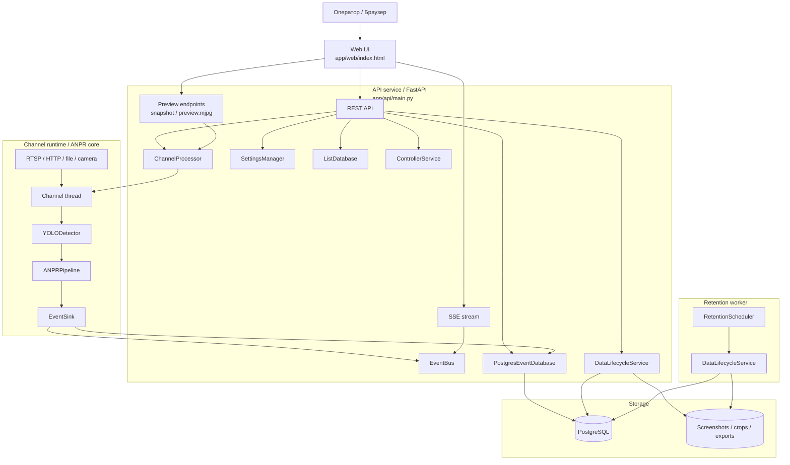
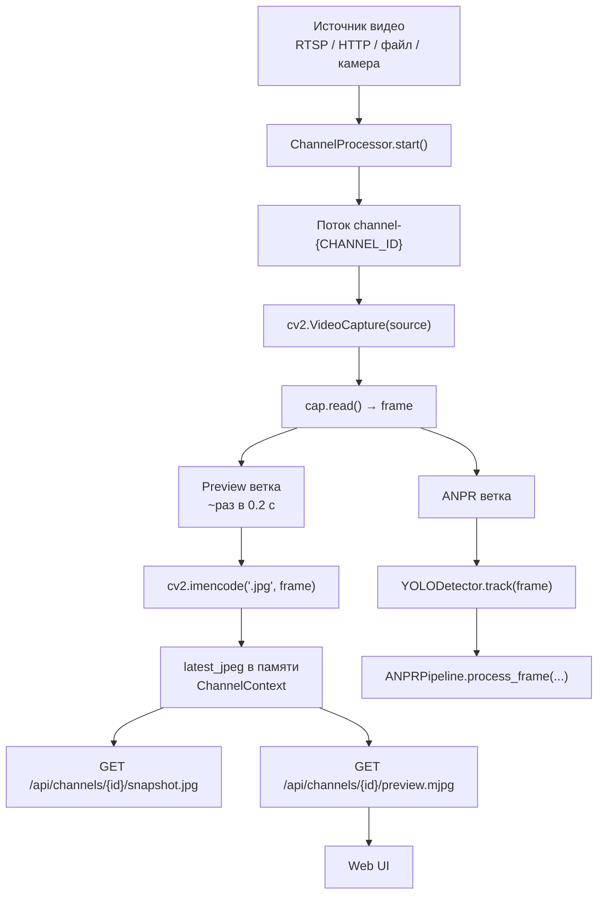
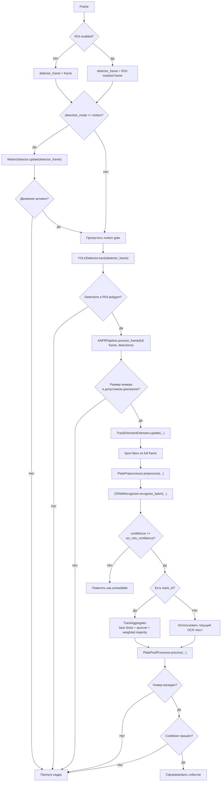
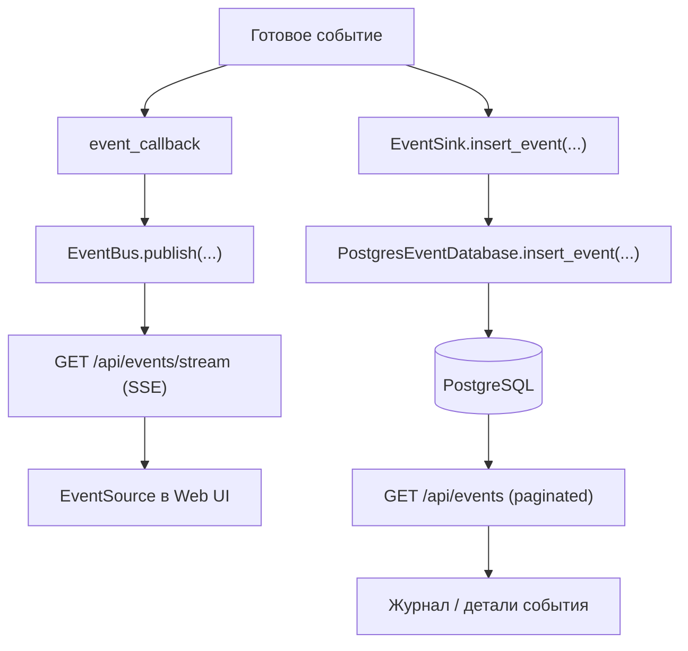
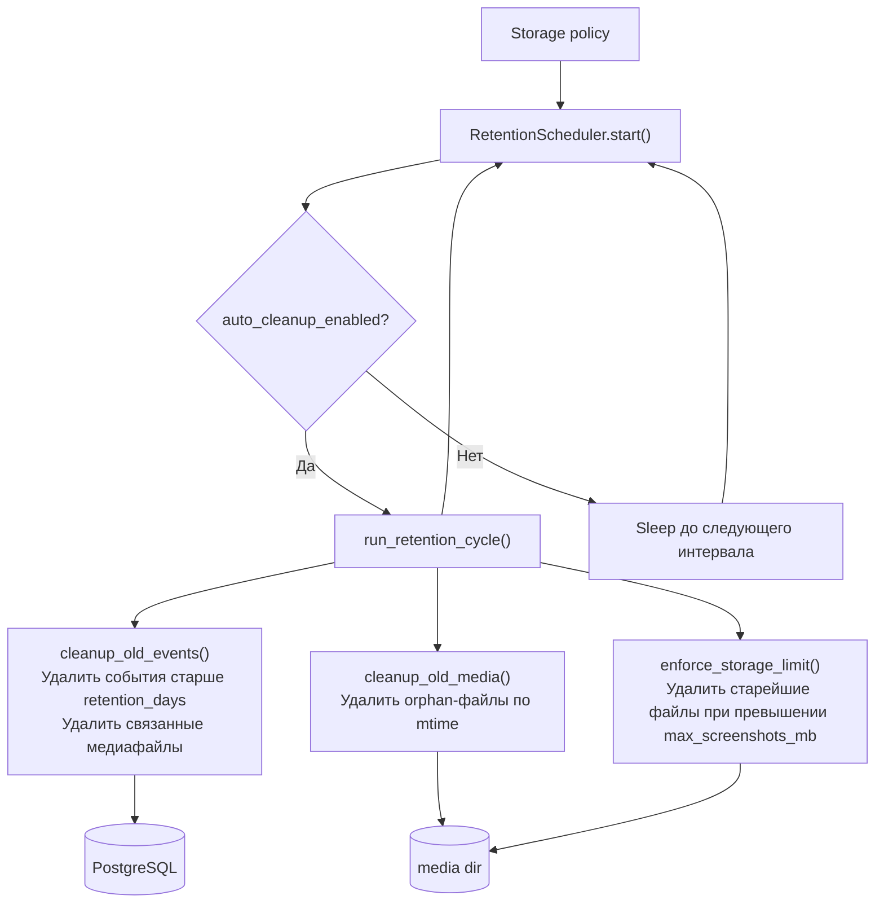

# ANPR System v0.8 Web


Многоканальная система автоматического распознавания автомобильных номеров с web-интерфейсом оператора.

Система выполняет server-side обработку видеопотоков, распознаёт номера, сохраняет события в PostgreSQL, публикует live-обновления в браузер через SSE и отдаёт live preview по MJPEG без отдельного медиасервера.

---

## Возможности

- многоканальная обработка видео: отдельный поток исполнения на каждый канал;
- server-side ANPR pipeline: детекция (YOLOv8), OCR (CRNN), агрегация по треку, постобработка, cooldown;
- web UI оператора: наблюдение, журнал событий, управление списками, настройки;
- live preview по MJPEG из того же channel runtime;
- live-события через SSE без опроса (long-lived stream с keepalive);
- управление каналами через API: создать, изменить, запустить, остановить, перезапустить;
- настройка ROI, размера номерного знака, OCR порогов, cooldown, motion gate;
- white / black / custom plate lists с фильтрацией событий для автоматической сработки реле;
- управление аппаратными контроллерами через API (тип DTWONDER2CH);
- retention / cleanup / CSV / ZIP export через отдельный worker-сервис;
- PostgreSQL — единственный поддерживаемый backend хранения данных.

---

## Архитектура

Система разделена на три контура:

1. **API service** (`app/api/`) — FastAPI-приложение: web UI, REST API, управление каналами, SSE-поток событий, preview endpoints.
2. **Channel runtime / ANPR core** (`runtime/`, `anpr/`) — для каждого канала создаётся отдельный поток, который открывает источник видео, формирует MJPEG preview в памяти и прогоняет кадры через полный ANPR pipeline.
3. **Retention worker** (`app/worker/`) — отдельный FastAPI-сервис для очистки старых событий, удаления медиа, контроля размера хранилища и экспорта.

### Диаграмма 1. Общая схема взаимодействия сервисов



---

## Быстрый старт

Поддерживаемая модель runtime: Docker Compose.

### Требования

- Docker Engine 24+
- Docker Compose v2+
- файлы моделей в `anpr/models/yolo/` и `anpr/models/ocr_crnn/`

### Подготовка

```bash
cp .env.example .env
# при необходимости отредактировать .env
```

### Запуск

```bash
docker compose up -d --build
```

Поднимаются четыре сервиса:

| Сервис | Описание | Внутренний адрес |
|---|---|---|
| `nginx` | Reverse proxy, единственная публичная точка входа | `HTTP_PORT` (по умолчанию `8080`) |
| `api` | FastAPI + Web UI + channel runtime | `api:8080` |
| `retention_worker` | Retention / cleanup / export | `retention_worker:8092` |
| `postgres` | PostgreSQL 16 с init-схемой | `postgres:5432` (только внутри сети) |

**Volumes:**
- `pgdata` — данные PostgreSQL
- `media_data` — `data/screenshots` и `data/exports`
- `logs_data` — `logs`

### Проверка

```bash
curl http://localhost:8080/api/health
curl http://localhost:8080/worker/health
curl http://localhost:8080/api/channels
curl -o snapshot.jpg http://localhost:8080/api/channels/1/snapshot.jpg
```

### Обновление / сброс

```bash
# Пересборка
docker compose build --no-cache && docker compose up -d

# Остановка
docker compose down

# Полный сброс данных (удаляет volumes)
docker compose down -v
```

---

## Конфигурация

| Файл | Назначение |
|---|---|
| `.env` | Переменные окружения для Docker Compose (`POSTGRES_*`, `HTTP_PORT`, `LOG_LEVEL`, `API_KEY`, `SETTINGS_PATH`) |
| `.env.example` | Шаблон `.env` |
| `config/settings.yaml` | Runtime-конфигурация: каналы, ROI, OCR, retention, контроллеры |

API и retention_worker используют один и тот же `SETTINGS_PATH=/app/config/settings.yaml`. PostgreSQL — единственный backend runtime-данных.

### Версионирование `settings.yaml`

- `settings_lineage: mainline` — каноническая линия схемы.
- `settings_version: 1` — текущая версия для этой линии.
- При загрузке legacy-конфиги (без `settings_lineage`) автоматически мигрируют до текущей схемы и сохраняются обратно.
- `settings_version` выше поддерживаемой → явная ошибка (без silent downgrade).
- Неизвестная `settings_lineage` → явная ошибка (без принудительной перезаписи).
- Любое изменение структуры полей требует повышения версии схемы и обновления migration path.

---

## ANPR Pipeline

### Диаграмма 2. Видеоввод и формирование preview



### Диаграмма 3. Внутренний ANPR pipeline



### Алгоритмы ядра

| Компонент | Алгоритм |
|---|---|
| **YOLODetector** | YOLOv8 с CUDA → CPU fallback; tracking fallback при потере трека; padding bbox перед кропом |
| **MotionDetector** | Абсолютная разность кадров → порог → гистерезис (счётчики активации/деактивации) |
| **PlatePreprocessor** | CLAHE + морфология → поиск четырёх точек → перспективная коррекция → выравнивание по HoughLines / min-area-rect |
| **CRNNRecognizer** | INT8-квантованная CRNN (32×128, grayscale); CTC-decode: argmax по шагам, удаление повторов, confidence = exp(mean(max logits)) |
| **TrackAggregator** | Скользящий буфер (text, confidence) на трек; взвешенное голосование с порогом quorum; TTL-вытеснение |
| **TrackDirectionEstimator** | История center_y и площади bbox на трек; APPROACHING = center_y ↓ + area ↑; RECEDING = center_y ↑ + area ↓; confidence = tanh(score) × density |
| **PlatePostProcessor** | Нормализация (uppercase, Ё→Е, strip) → коррекции по стране → валидация против regex-форматов YAML-конфигов |

---

## Поток данных

### Диаграмма 4. Сохранение и публикация события



### Шаги обработки

1. **Подключение канала** — при старте API читает каналы из `config/settings.yaml`; `ChannelProcessor` создаёт `ChannelContext` и запускает поток для каждого `enabled=true` канала.
2. **Получение кадров** — поток открывает источник через `cv2.VideoCapture(source)` и в цикле вызывает `cap.read()`.
3. **Reconnect логика**:
   - `reconnect.signal_loss.enabled` — контроль таймаута чтения; при таймауте увеличивается `timeout_count`, выполняется controlled reconnect.
   - `reconnect.periodic.enabled` — принудительный reconnect каждые `interval_minutes` независимо от signal-loss.
   - При каждом reconnect увеличивается `reconnect_count`.
4. **Preview** — ~раз в 0.2 с кадр кодируется в JPEG и сохраняется в `ChannelContext.latest_jpeg`; отдаётся как snapshot или MJPEG поток.
5. **Детекция и распознавание** — кадр идёт в `YOLODetector.track()`, затем в `ANPRPipeline.process_frame()`.
6. **Сохранение события** — валидный номер (с прошедшим cooldown) записывается в PostgreSQL через `EventSink`, затем публикуется в `EventBus` для SSE.

---

## Модули

### app/ — Приложение

| Файл | Ответственность |
|---|---|
| `app/api/main.py` | FastAPI app, middleware, роутеры, lifecycle |
| `app/api/auth.py` | `APIKeyMiddleware`: валидация ключа из заголовка / query param; исключения для health, SSE, preview |
| `app/api/container.py` | `AppContainer`: DI-контейнер всех сервисов; `build()`, `startup()`, `shutdown()` |
| `app/api/deps.py` | FastAPI зависимости (`get_container()`) |
| `app/api/schemas.py` | Все Pydantic модели запросов и ответов |
| `app/api/routers/channels.py` | CRUD каналов, start/stop/restart, snapshot, MJPEG, health |
| `app/api/routers/events.py` | Журнал событий, детали, медиа, SSE-поток |
| `app/api/routers/controllers.py` | CRUD аппаратных контроллеров, тест реле |
| `app/api/routers/lists.py` | Управление plate lists и записями |
| `app/api/routers/settings.py` | Глобальные настройки (с перезапуском pipeline при изменении) |
| `app/api/routers/data.py` | Retention policy, ручной запуск, CSV/ZIP export |
| `app/api/routers/system.py` | Health check, CPU/RAM, статус БД, Web UI |
| `app/api/routers/debug.py` | Debug-настройки, overlay state, лог-панель SSE |
| `app/worker/main.py` | `RetentionScheduler`: async цикл retention; отдельный FastAPI |
| `app/shared/data_lifecycle.py` | `DataLifecycleService`: cleanup событий/медиа, контроль размера, CSV/ZIP export |
| `app/web/` | Статика Web UI (HTML, JS, CSS, флаги стран) |

### runtime/ — Channel Runtime

| Файл | Ответственность |
|---|---|
| `runtime/channel_runtime.py` | `ChannelProcessor`: запуск/остановка/restart потоков каналов; preview cache; метрики |
| `runtime/event_bus.py` | `EventBus`: async in-memory pub/sub на `asyncio.Queue` (maxsize 512); drop oldest при переполнении |
| `runtime/event_sink.py` | `EventSink`: тонкая обёртка над `PostgresEventDatabase` для записи событий |
| `runtime/debug.py` | `DebugRegistry`: хранит debug overlay state (bbox, OCR, direction) по каналу с TTL |

### anpr/ — ANPR Core

| Файл | Ответственность |
|---|---|
| `anpr/detection/yolo_detector.py` | `YOLODetector`: YOLOv8 + tracking; CUDA fallback; size filter; bbox padding |
| `anpr/detection/motion_detector.py` | `MotionDetector`: motion gate; гистерезис по счётчикам кадров |
| `anpr/preprocessing/plate_preprocessor.py` | `PlatePreprocessor`: CLAHE, морфология, перспективная коррекция, выравнивание |
| `anpr/recognition/crnn_recognizer.py` | `CRNNRecognizer`: INT8 CRNN; `recognize_batch()`; CTC decode |
| `anpr/recognition/crnn.py` | Архитектура CRNN (Conv + RNN backbone) |
| `anpr/pipeline/anpr_pipeline.py` | `ANPRPipeline`, `TrackAggregator`, `TrackDirectionEstimator` |
| `anpr/postprocessing/validator.py` | `PlatePostProcessor`: нормализация, коррекции, валидация |
| `anpr/postprocessing/country_config.py` | `CountryConfigLoader`: загрузка YAML-конфигов стран, компиляция regex |
| `anpr/model_config.py` | `AnprModelConfig`: пути к моделям, параметры |
| `anpr/countries/` | YAML-конфиги форматов номеров: `russia.yaml`, `ukraine.yaml`, `belarus.yaml`, `kazakhstan.yaml` |

### controllers/ — Аппаратные контроллеры

| Файл | Ответственность |
|---|---|
| `controllers/service.py` | `ControllerService`: отправка HTTP-команд контроллерам; error cooldown; async dispatch |
| `controllers/registry.py` | Реестр типов адаптеров |
| `controllers/base.py` | `BaseAdapter`: интерфейс адаптера |
| `controllers/adapters/dtwonder2ch.py` | Адаптер DTWONDER2CH: построение URL команды по relay index и mode |

### database/ — Хранение данных

| Файл | Ответственность |
|---|---|
| `database/postgres_event_repository.py` | `PostgresEventDatabase`: события — insert, pagination, fetch, delete, export |
| `database/plate_lists_repository.py` | `ListDatabase`: plate lists и entries — CRUD, проверка вхождения номера |
| `database/postgres/schema.sql` | SQL-схема инициализации |
| `database/errors.py` | `StorageUnavailableError` |

### config/ — Конфигурация

| Файл | Ответственность |
|---|---|
| `config/settings_manager.py` | `SettingsManager`: оркестрация настроек, геттеры/сеттеры всех секций |
| `config/settings_repository.py` | `SettingsRepository`: чтение/запись `settings.yaml` с file lock |
| `config/settings_normalizer.py` | `SettingsNormalizer`: defaults, upgrade legacy-конфигов |
| `config/settings_schema.py` | Схема и дефолты всех секций |
| `config/settings_migrations/` | Миграции формата схемы |

### common/ — Утилиты

| Файл | Ответственность |
|---|---|
| `common/logging.py` | `configure_logging()`: `HourlyFileHandler` (ротация по часу), `LiveDebugHandler` (SSE буфер), `ServiceNameFilter` |

---

## REST и streaming endpoints

### Web UI

| Метод | Путь | Описание |
|---|---|---|
| `GET` | `/` | Операторская панель (index.html) |

### Channels

| Метод | Путь | Описание |
|---|---|---|
| `GET` | `/api/channels` | Список каналов с метриками и debug state |
| `POST` | `/api/channels` | Создать канал |
| `PUT` | `/api/channels/{channel_id}` | Обновить канал |
| `GET` | `/api/channels/last-plates` | Последний распознанный номер по каждому каналу |
| `PUT` | `/api/channels/{channel_id}/config` | Обновить базовую конфигурацию |
| `PUT` | `/api/channels/{channel_id}/ocr` | Обновить OCR-параметры (best_shots, cooldown, confidence) |
| `PUT` | `/api/channels/{channel_id}/filter` | Обновить фильтры размера и plate lists |
| `POST` | `/api/channels/{channel_id}/start` | Запустить поток канала |
| `POST` | `/api/channels/{channel_id}/stop` | Остановить поток канала |
| `POST` | `/api/channels/{channel_id}/restart` | Перезапустить поток канала |
| `GET` | `/api/channels/{channel_id}/health` | Метрики канала |
| `GET` | `/api/channels/{channel_id}/snapshot.jpg` | Единичный JPEG кадр |
| `GET` | `/api/channels/{channel_id}/preview/status` | Готовность preview |
| `GET` | `/api/channels/{channel_id}/preview.mjpg` | MJPEG-поток (`multipart/x-mixed-replace`) |

### Events

| Метод | Путь | Описание |
|---|---|---|
| `GET` | `/api/events` | Журнал событий; параметры: `limit`, `before_ts`, `before_id`, `channel_id`, `plate`; сортировка `timestamp DESC, id DESC` |
| `GET` | `/api/events/item/{event_id}` | Детали события |
| `GET` | `/api/events/item/{event_id}/media/{kind}` | Медиафайл события (`kind=frame` или `plate`) |
| `GET` | `/api/events/stream` | SSE-поток live событий (`text/event-stream`; keepalive `: ping`; auto-retry) |

### Controllers

| Метод | Путь | Описание |
|---|---|---|
| `GET` | `/api/controllers` | Список контроллеров |
| `POST` | `/api/controllers` | Создать контроллер |
| `PUT` | `/api/controllers/{controller_id}` | Обновить контроллер |
| `DELETE` | `/api/controllers/{controller_id}` | Удалить контроллер (блокируется, если используется каналом) |
| `POST` | `/api/controllers/{controller_id}/test` | Отправить тестовую команду реле |

### Plate Lists

| Метод | Путь | Описание |
|---|---|---|
| `GET` | `/api/lists` | Список всех plate lists |
| `POST` | `/api/lists` | Создать список |
| `PUT` | `/api/lists/{list_id}` | Обновить метаданные списка |
| `DELETE` | `/api/lists/{list_id}` | Удалить список |
| `GET` | `/api/lists/{list_id}/entries` | Записи в списке |
| `POST` | `/api/lists/{list_id}/entries` | Добавить запись |
| `PUT` | `/api/lists/{list_id}/entries/{entry_id}` | Обновить запись |
| `GET` | `/api/lists/entry-by-plate` | Найти запись по номеру |
| `GET` | `/api/lists/plates` | Все номера с типами списков |

### Settings

| Метод | Путь | Описание |
|---|---|---|
| `GET` | `/api/settings` | Все глобальные настройки |
| `PUT` | `/api/settings` | Обновить настройки (изменение plate config / DSN / screenshots_dir перезапускает pipeline) |

### Data & Export

| Метод | Путь | Описание |
|---|---|---|
| `GET` | `/api/data/policy` | Retention policy |
| `PUT` | `/api/data/policy` | Обновить retention policy |
| `POST` | `/api/data/retention/run` | Запустить retention cycle вручную |
| `GET` | `/api/data/export/events.csv` | Экспорт событий в CSV |
| `POST` | `/api/data/export/bundle` | Экспорт событий в ZIP (с медиа по выбору) |

### System & Telemetry

| Метод | Путь | Описание |
|---|---|---|
| `GET` | `/api/health` | Health check API |
| `GET` | `/api/system/resources` | CPU и RAM (psutil) |
| `GET` | `/api/storage/status` | Статус PostgreSQL |
| `GET` | `/api/telemetry/channels` | Метрики каналов (FPS, latency, reconnect_count и др.) |

### Debug

| Метод | Путь | Описание |
|---|---|---|
| `GET` | `/api/debug/settings` | Debug-настройки |
| `PUT` | `/api/debug/settings` | Обновить debug-настройки |
| `GET` | `/api/debug/channels` | Метрики + debug state каналов |
| `GET` | `/api/debug/state` | Агрегированный debug state (overlay: bbox, OCR, direction) |
| `GET` | `/api/debug/logs` | Последние логи (snapshot) |
| `GET` | `/api/debug/logs/stream` | SSE-поток логов в реальном времени |

Debug overlay (bbox, OCR-текст, direction) — только данные; отрисовка выполняется в web UI поверх ``. Overlay очищается по TTL.

### Worker

| Метод | Путь | Описание |
|---|---|---|
| `GET` | `/worker/health` | Health check worker |
| `POST` | `/worker/retention/run` | Ручной запуск retention cycle через worker |

---

## Диаграмма 5. Retention и обслуживание хранилища



---

## Контроллеры и plate lists

### Привязка контроллера к каналу

- Контроллер настраивается отдельно: имя, тип, адрес, пароль, 2 реле с режимом и хоткеем.
- В конфиге канала указываются `controller_id`, `controller_relay`, `list_filter_mode`, `list_filter_list_ids`.
- Режим реле задаётся в контроллере, а не в канале.
- При удалении контроллера, который используется каналом, API возвращает ошибку.

### Режимы фильтрации для автосработки реле

| Режим | Поведение |
|---|---|
| `all` | Реле срабатывает для любого номера, кроме номеров из black list |
| `whitelist` | Реле срабатывает только для номеров из списков типа `white`; black list блокирует |
| `custom` | Реле срабатывает только для номеров из выбранных списков (`list_filter_list_ids`); black list блокирует |

Приоритет black list абсолютный.

### Режимы реле

| Режим | Описание |
|---|---|
| `pulse` | Без таймера (timer_seconds=1) |
| `pulse_timer` | С таймером >= 1 с |

### Хоткеи реле

- Хоткей задаётся на конкретное реле конкретного контроллера.
- По нажатию в web UI отправляется `POST /api/controllers/{controller_id}/test`.
- Блокируется при фокусе в `input/textarea/select/contenteditable` или при key repeat.
- Дубликаты хоткеев в одном контроллере запрещены валидацией API.

---

## Структура проекта

```text
ANPR-System-v0.8_web/
├── app/
│   ├── api/                       # FastAPI backend
│   │   ├── main.py
│   │   ├── auth.py
│   │   ├── container.py
│   │   ├── deps.py
│   │   ├── schemas.py
│   │   └── routers/
│   │       ├── channels.py
│   │       ├── events.py
│   │       ├── controllers.py
│   │       ├── lists.py
│   │       ├── settings.py
│   │       ├── data.py
│   │       ├── debug.py
│   │       └── system.py
│   ├── worker/
│   │   └── main.py                # Retention worker FastAPI
│   ├── web/                       # Web UI (HTML, JS, CSS, флаги)
│   └── shared/
│       └── data_lifecycle.py      # Retention / cleanup / export
├── runtime/                       # Channel runtime
│   ├── channel_runtime.py
│   ├── event_bus.py
│   ├── event_sink.py
│   └── debug.py
├── anpr/                          # ANPR core
│   ├── detection/
│   │   ├── yolo_detector.py
│   │   └── motion_detector.py
│   ├── preprocessing/
│   │   └── plate_preprocessor.py
│   ├── recognition/
│   │   ├── crnn_recognizer.py
│   │   └── crnn.py
│   ├── postprocessing/
│   │   ├── validator.py
│   │   └── country_config.py
│   ├── pipeline/
│   │   ├── anpr_pipeline.py
│   │   └── factory.py
│   ├── model_config.py
│   ├── models/                    # Файлы моделей (не в git)
│   │   ├── yolo/
│   │   └── ocr_crnn/
│   └── countries/                 # YAML-конфиги форматов номеров
│       ├── russia.yaml
│       ├── ukraine.yaml
│       ├── belarus.yaml
│       └── kazakhstan.yaml
├── controllers/
│   ├── service.py
│   ├── registry.py
│   ├── base.py
│   └── adapters/
│       └── dtwonder2ch.py
├── database/
│   ├── postgres_event_repository.py
│   ├── plate_lists_repository.py
│   ├── errors.py
│   └── postgres/
│       └── schema.sql
├── config/
│   ├── settings.yaml              # Runtime-конфиг (рабочий)
│   ├── settings_manager.py
│   ├── settings_repository.py
│   ├── settings_normalizer.py
│   ├── settings_schema.py
│   └── settings_migrations/
├── common/
│   └── logging.py
├── tests/
│   ├── test_plate_validator.py
│   ├── test_motion_detector.py
│   ├── test_direction_estimator.py
│   └── test_track_aggregator.py
├── nginx/
│   └── default.conf
├── docker-compose.yml
├── Dockerfile
├── requirements.txt
├── .env
└── .env.example
```

---

## Хранение данных

### PostgreSQL (обязательно)

Все события и plate lists хранятся в PostgreSQL через `POSTGRES_DSN`.

**Таблицы:**

| Таблица | Поля |
|---|---|
| `events` | `id`, `timestamp`, `channel_id`, `channel`, `plate`, `country`, `confidence`, `source`, `frame_path`, `plate_path`, `direction` |
| `plate_lists` | `id`, `name`, `type` |
| `plate_list_entries` | `id`, `list_id`, `plate`, `plate_normalized`, `comment` |

**Индексы:** `(timestamp DESC, id DESC)` по событиям; `plate_normalized` и `(list_id, plate_normalized) UNIQUE` по записям.

### Медиа и экспорт

- Медиа сохраняются в `storage.screenshots_dir`.
- CSV-экспорт создаётся в `storage.export_dir`.
- Bundle export упаковывает CSV и доступные медиафайлы в ZIP.

---

## Технологический стек

| Слой | Технологии |
|---|---|
| Backend | FastAPI, Uvicorn, Python 3.13 |
| Detection | YOLOv8 (Ultralytics 8.3.20) |
| OCR | CRNN (INT8 quantized) |
| Video I/O | OpenCV |
| ML runtime | PyTorch 2.8.0, torchvision 0.23.0, torchaudio 2.8.0 (CPU wheel) |
| Live updates | SSE (`text/event-stream`) |
| Preview | MJPEG (`multipart/x-mixed-replace`) |
| Storage | PostgreSQL 16 (psycopg driver) |
| Config | YAML (PyYAML) |
| Reverse proxy | Nginx |
| Containerization | Docker, Docker Compose |
| Monitoring | psutil (CPU / RAM) |

---

## License

MIT
