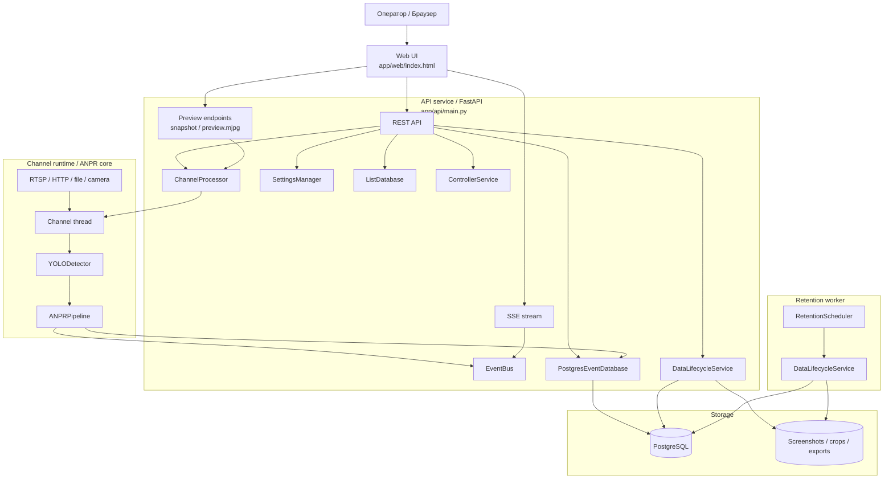
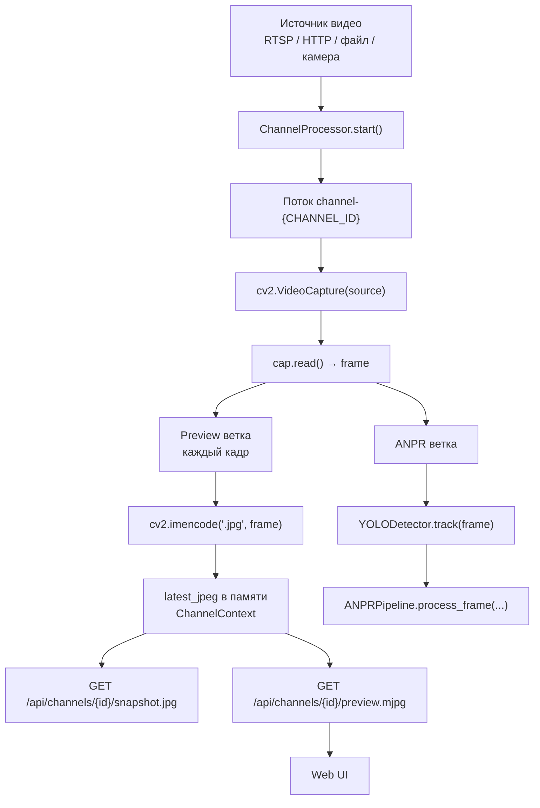
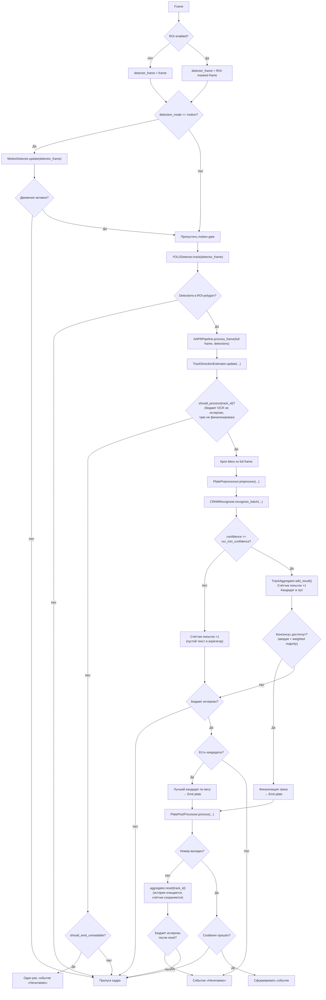
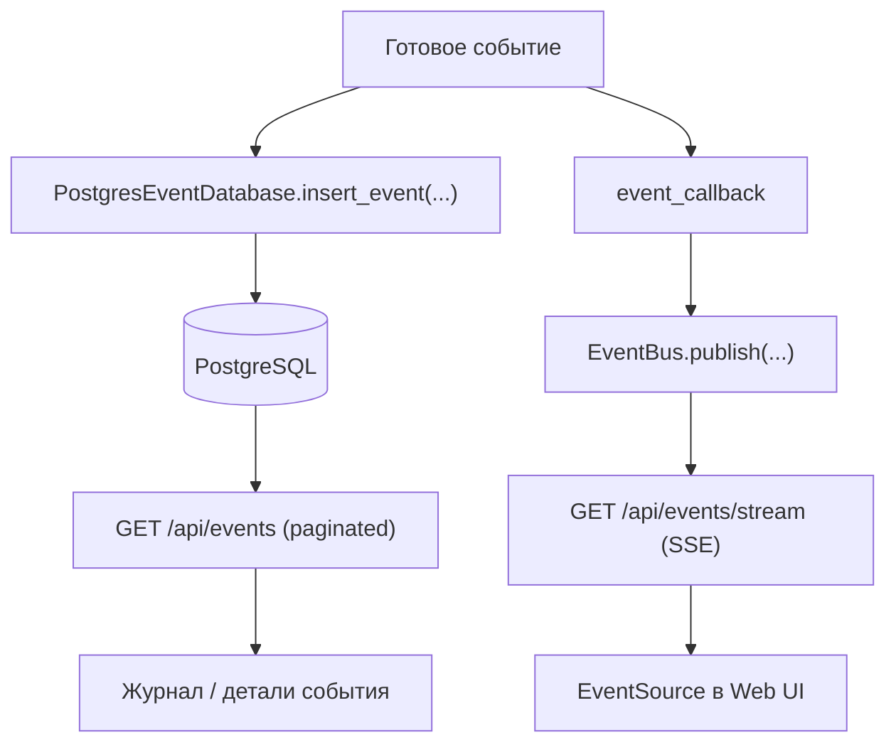
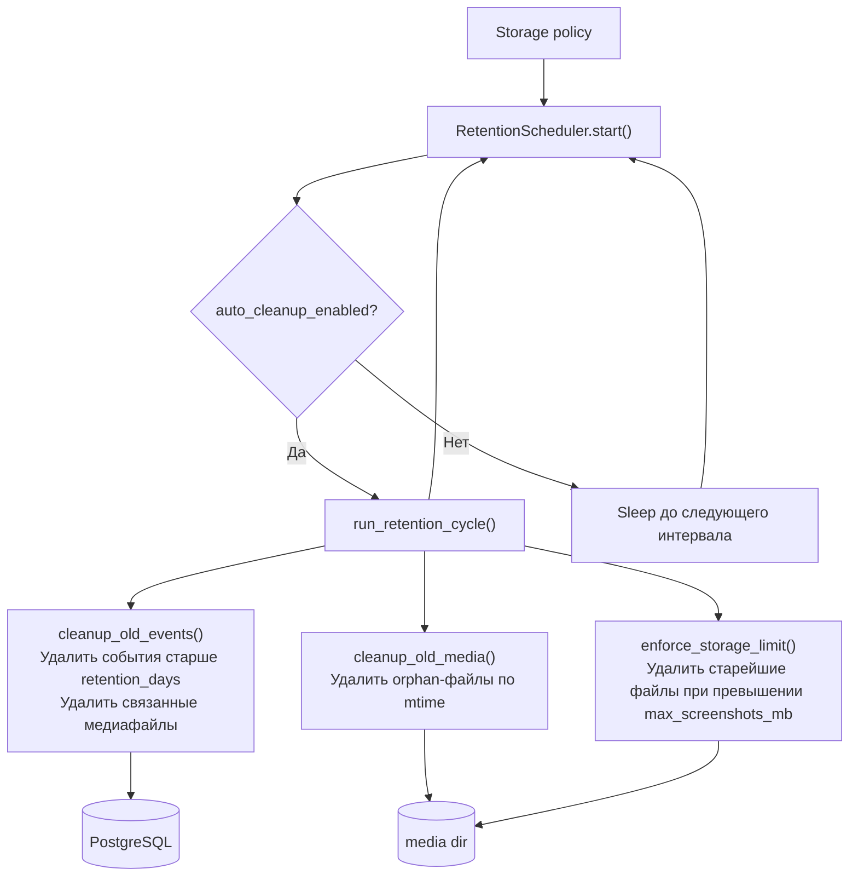

# Диаграммы

Этот файл содержит вынесенные из корневого README схемы проекта. README остаётся короче и работает как обзорная точка входа, а все mermaid-диаграммы собраны здесь.

## 1. Общая схема взаимодействия сервисов

## 2. Видеоввод и формирование preview

## 3. Внутренний ANPR pipeline

## 4. Сохранение и публикация события

## 5. Retention и обслуживание хранилища

